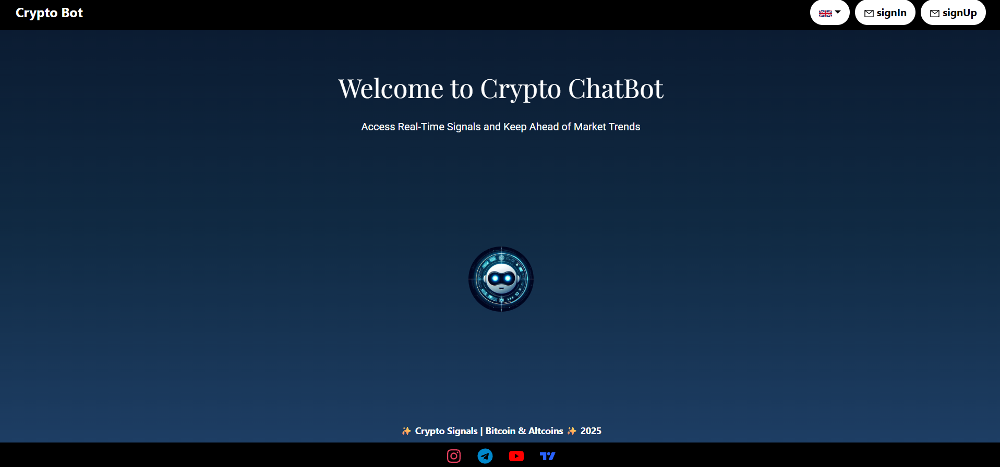
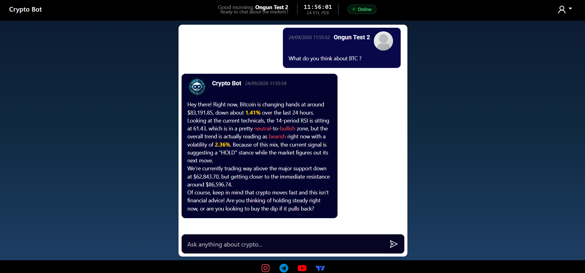

# Crypto Bot — AI-Powered Crypto Analyst

> **Source code is private.** This repository documents the architecture,
> API contract and engineering decisions behind a production-deployed
> AI crypto analyst.

🔗 **[Live demo →](https://crypto-bot-frontend-lhne.vercel.app)**

---

## 🎯 What it does

An AI crypto analyst that answers natural-language questions about Bitcoin
using **real market data**. It does not hallucinate numbers — it computes
indicators (RSI, trend, support/resistance) from 90 days of historical
price data, then asks Gemini to **explain those numbers** in plain language.

**Design principle:** Gemini is used for *explanation*, never for
*computation*. Deterministic math stays in Python; language stays in the model.

---

## 📐 System at a Glance

```
React 18 SPA (Vercel)  →  Flask API (Render)  →  MongoDB Atlas
                                ↓
                    CoinGecko + Gemini AI
```

📖 **[Full architecture with diagrams →](./architecture.md)**

---

## 🧩 Tech Stack

| Layer | Technology |
|-------|-----------|
| Frontend | React 18, Zustand, React-Bootstrap, React Router |
| Backend | Flask, Gunicorn, pandas, ta |
| Database | MongoDB Atlas |
| AI | Google Gemini 3.5 Flash Lite |
| Market Data | CoinGecko API |
| Deployment | Vercel + Render |
| Monitoring | UptimeRobot |

---

## 🧠 Engineering Highlights

- **Deterministic AI boundary** — Gemini explains metrics, never computes them
- **Stale-while-revalidate cache** — 5-min CoinGecko cache with background refresh
- **Single HTTP boundary** — all API calls flow through one `brain.js` client
- **Graceful degradation** — AI failure returns raw metrics with a fallback message
- **Session revocation** — logout deletes the token server-side immediately

📖 **[Full engineering notes & roadmap →](./engineering-notes.md)**

---

## 📊 System Maturity

| Layer | Status |
|-------|--------|
| Auth · Chat · Profile · Deployment | ✅ Production |
| Security · Observability · Docs | 🟡 Hardening |
| Testing | 🔴 Roadmap |

---

## 🔌 API Surface

7 endpoints across auth, chat and system. Full spec:
📖 **[api-contract.md →](./api-contract.md)**

---

## 📸 Screenshots


<br>


---

## 🚧 Known Constraints

This is a production MVP. Documented limitations:

- No token TTL (sessions never expire)
- CORS wildcard (defense-in-depth reduced)
- No rate limiting
- Render free tier: 30–60s cold start
- No automated test coverage yet

Each has a mitigation path in [`engineering-notes.md`](./engineering-notes.md).

---

## 📚 Documentation

| File | Contents |
|------|----------|
| [`architecture.md`](./architecture.md) | System design, data flow, sequence diagrams |
| [`api-contract.md`](./api-contract.md) | Full HTTP API specification |
| [`engineering-notes.md`](./engineering-notes.md) | Trade-offs, lessons learned, roadmap |

---

## 📜 License

MIT — see [`LICENSE`](./LICENSE).

---

**Author:** [Ongun Akay](https://ongunakay.com) · Senior Full-Stack Developer
**Status:** ✅ Live in production
```