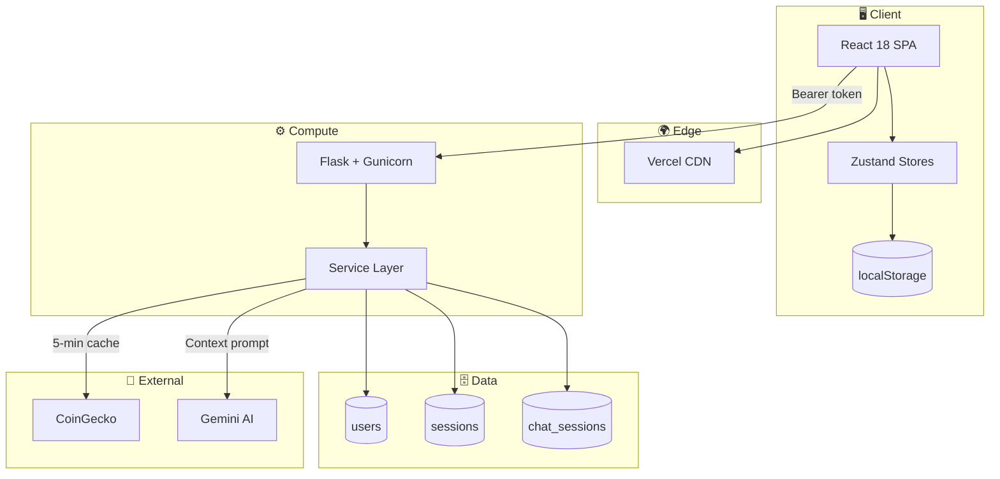

# Crypto Bot — AI-Powered Crypto Analyst (Case Study)

> **Source code is private.** This repository documents the architecture,
> API contract and engineering decisions behind a production-deployed
> AI crypto analyst. It is a case study, not the application source.

🔗 **Live demo:** [crypto-bot-frontend-lhne.vercel.app](https://crypto-bot-frontend-lhne.vercel.app)

---

## 🎯 What it does

An AI crypto analyst that answers natural-language questions about Bitcoin
using real market data. It does **not** hallucinate numbers — it computes
indicators (RSI, trend, support/resistance) from 90 days of historical
price data, then asks Gemini to **explain those numbers** in plain language.

The AI layer is deliberately narrow: Gemini is used for **explanation**,
never for **computation**. Deterministic math stays in Python; language
stays in the model.

---

## 🏗️ Architecture

Full architecture with sequence diagrams: [`architecture.md`](./architecture.md)

---

## 🧩 Tech Stack

| Layer | Technology |
|-------|-----------|
| **Frontend** | React 18, Zustand, React-Bootstrap, React Router |
| **Backend** | Flask, Gunicorn, pandas, ta |
| **Database** | MongoDB Atlas |
| **AI** | Google Gemini 3.5 Flash Lite |
| **Market Data** | CoinGecko API |
| **Deployment** | Vercel (frontend) + Render (backend) |
| **Monitoring** | UptimeRobot |

---

## 🔌 API Contract

See [`api-contract.md`](./api-contract.md) for the full specification.

**Highlights:**

| Endpoint | Purpose |
|----------|---------|
| `POST /auth/signup` | Register new user |
| `POST /auth/login` | Authenticate |
| `GET /auth/me` | Current user |
| `POST /chat` | AI-augmented BTC analysis |
| `GET /chat/history` | Retrieve conversation |
| `GET /metrics` | Raw BTC metrics (no AI) |
| `GET /` | Health check (uptime) |

---

## 🧠 Engineering Notes

See [`engineering-notes.md`](./engineering-notes.md) for trade-offs,
lessons learned and the full roadmap.

**Highlights:**

- **Deterministic AI boundary** — Gemini explains metrics, never computes them
- **Stale-while-revalidate cache** — 5-min CoinGecko cache with background refresh
- **Single HTTP boundary** — all API calls flow through one `brain.js` client
- **Graceful degradation** — AI failure returns raw metrics with fallback message
- **Session revocation** — logout deletes the token server-side immediately

---

## 📊 System Maturity

| Layer | Status | Notes |
|-------|--------|-------|
| Auth | ✅ Production | scrypt + session tokens |
| Chat | ✅ Production | Context-aware, 5-min cache |
| Profile | ✅ Production | Name + photo update |
| Deployment | ✅ Production | Auto-deploy via git push |
| Security | 🟡 Hardening | CORS, TTL, rate limiting pending |
| Observability | 🟡 Partial | Uptime monitor, no error tracking |
| Testing | 🔴 Roadmap | pytest + Jest planned |
| Docs | 🟡 In progress | This repo — actively maintained |

---

## 📸 Screenshots

> _Pending — will be added shortly._

---

## 🚧 Known Constraints

This is a production MVP, not a finished product. Known limitations are
documented openly:

- No token TTL (sessions never expire)
- CORS wildcard (defense-in-depth reduced)
- No rate limiting
- Render free tier: 30–60s cold start
- No automated test coverage yet

Each of these has a documented mitigation path in
[`engineering-notes.md`](./engineering-notes.md).

---

## 📚 Related Documents

- [`architecture.md`](./architecture.md) — system design and diagrams
- [`api-contract.md`](./api-contract.md) — full HTTP API spec
- [`engineering-notes.md`](./engineering-notes.md) — decisions & roadmap

---

## 📜 License

MIT — see [`LICENSE`](./LICENSE).