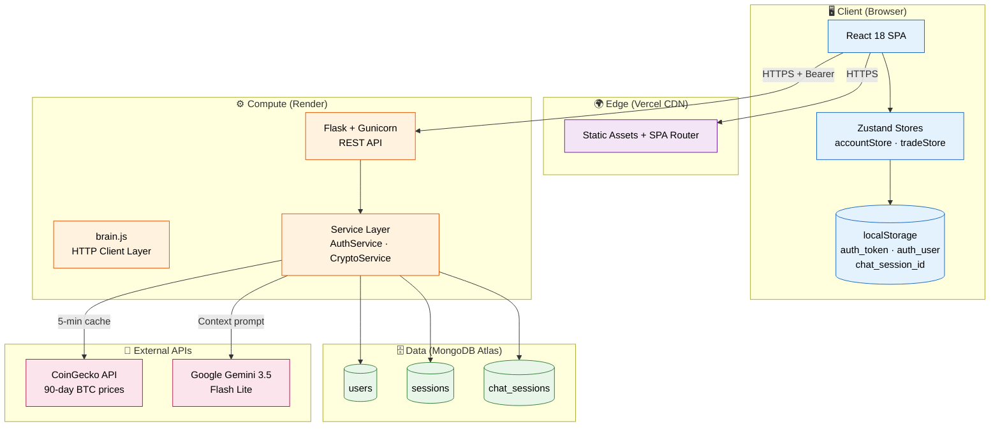
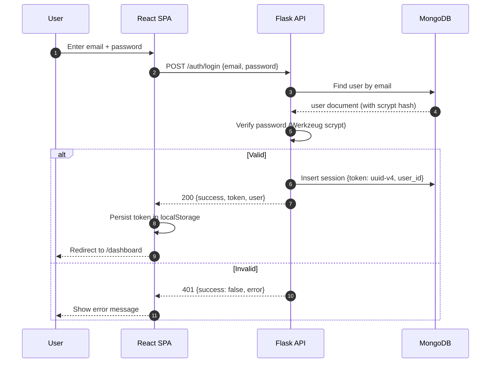
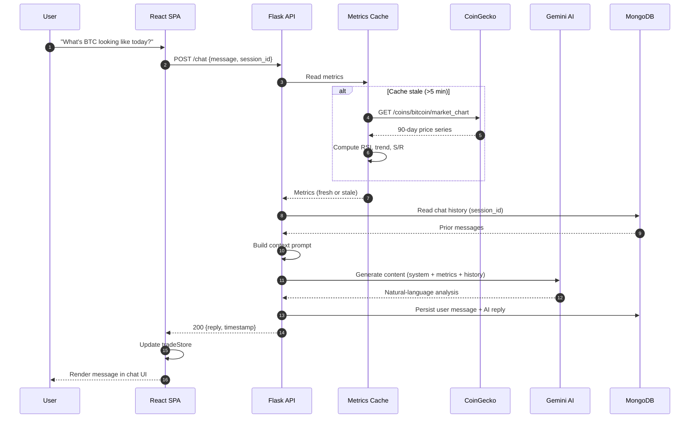
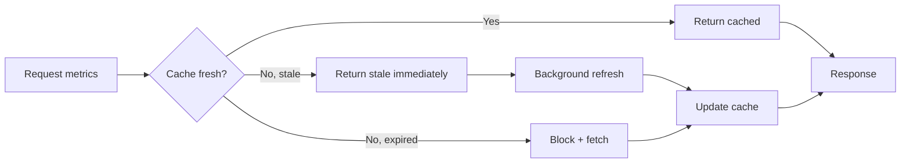
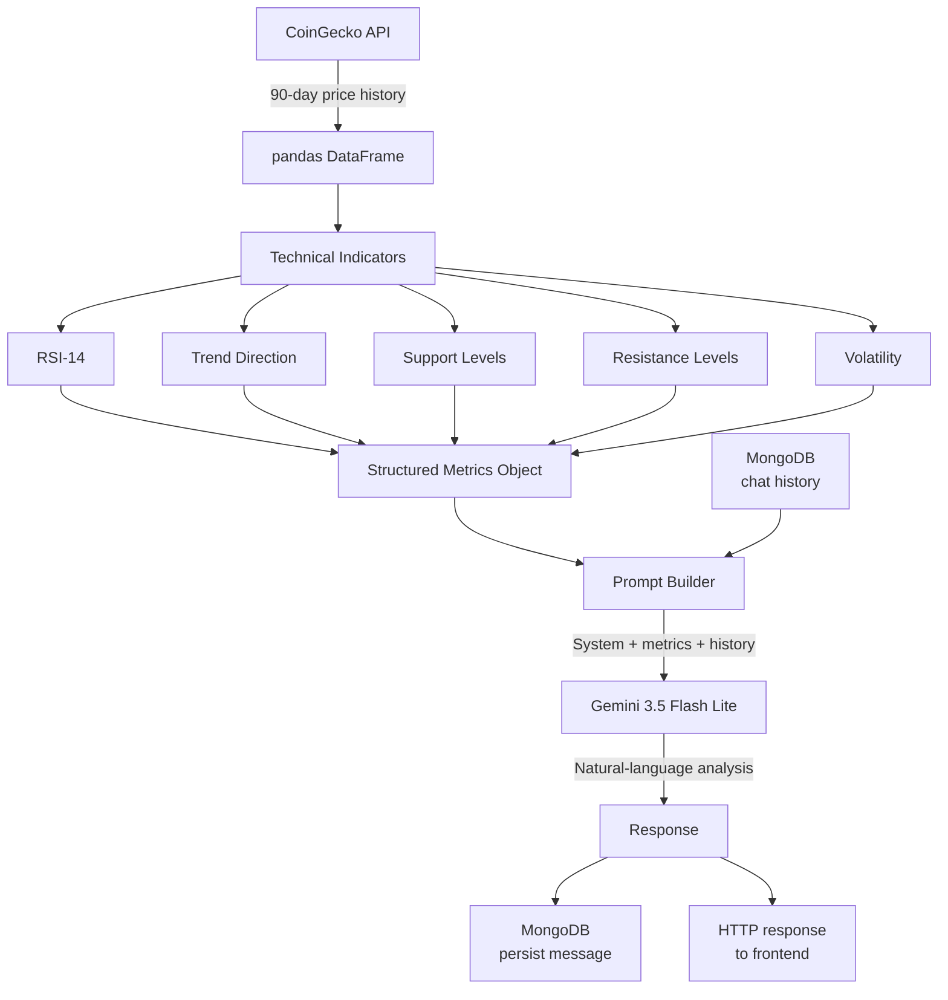
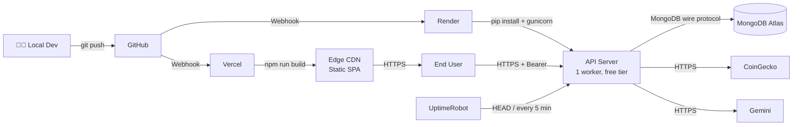
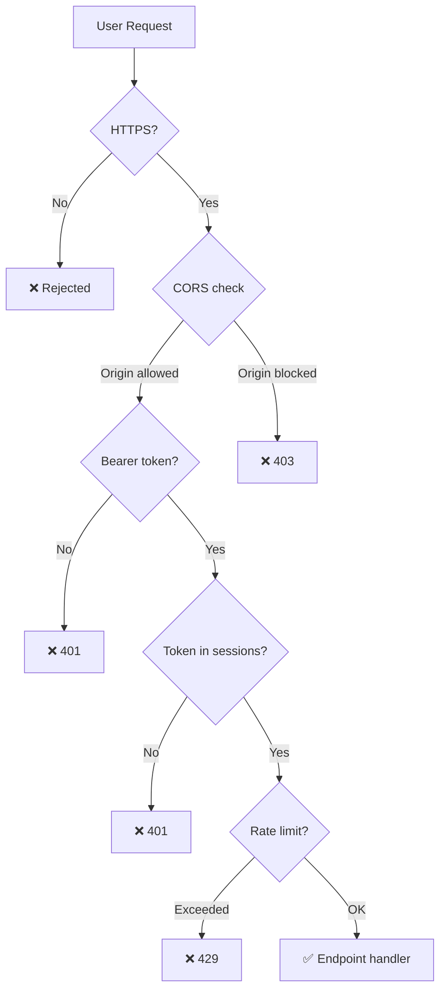

# 🏗️ Architecture — Crypto Bot

> High-level architecture, data flow and system boundaries for Crypto Bot.
> This document is part of the [Crypto Bot Case Study](./README.md).

---

## 📌 Table of Contents

1. [System Overview](#-system-overview)
2. [Component Diagram](#-component-diagram)
3. [Data Flow](#-data-flow)
4. [Data Layer](#-data-layer)
5. [AI Pipeline](#-ai-pipeline)
6. [Deployment Topology](#-deployment-topology)
7. [Security Layers](#-security-layers)
8. [Design Decisions](#-design-decisions)
9. [Known Constraints](#-known-constraints)

---

## 🌐 System Overview

Crypto Bot is a **three-tier web application** with an **AI augmentation layer**:

- **Presentation tier** — React SPA served from Vercel's edge CDN
- **Application tier** — Flask REST API on Render
- **Data tier** — MongoDB Atlas (managed)
- **External services** — CoinGecko (market data), Google Gemini (LLM)

The system is deliberately **stateless on the compute side**: both Vercel and Render
can scale horizontally without sticky sessions because authentication uses bearer
tokens persisted in MongoDB, not in-memory sessions.

---

## 🧩 Component Diagram



---

## 🔄 Data Flow

### 1. Authentication Flow



### 2. Chat Flow (AI-Augmented)



### 3. Metric Refresh (Stale-While-Revalidate)



> **Why stale-while-revalidate?**  
> CoinGecko rate limits and cold-start latency would otherwise surface as
> user-visible delays in the chat UI. Stale-while-revalidate trades a small
> amount of data freshness for consistently sub-second response times.

---

## 🗄️ Data Layer

**Database:** `crypto_db` (MongoDB Atlas)

| Collection | Purpose | Unique Key | TTL | Indexes |
|------------|---------|------------|-----|---------|
| `users` | User accounts | `email` | Permanent | `email` (unique) |
| `sessions` | Auth tokens | `token` | None ⚠️ | `token` (unique) |
| `chat_sessions` | Chat history | `session_id` | Permanent | `session_id` (unique) |

### Document Shapes

```javascript
// users
{
  _id: ObjectId,
  email: "user@example.com",
  name: "Jane Doe",
  password_hash: "scrypt:32768:8:1$...",
  photoURL: "https://...",        // optional, base64 or URL
  created_at: ISODate
}

// sessions
{
  _id: ObjectId,
  token: "uuid-v4",
  user_id: ObjectId,              // references users._id
  created_at: ISODate
}

// chat_sessions
{
  _id: ObjectId,
  session_id: "user-xxx-1234567890",
  messages: [
    { role: "user",      content: "...", timestamp: ISODate },
    { role: "assistant", content: "...", timestamp: ISODate }
  ]
}
```

### Password Hashing

Werkzeug's `generate_password_hash` with default parameters:

```
scrypt:32768:8:1$<salt>$<hash>
```

- **Algorithm:** scrypt
- **N (CPU cost):** 32768
- **r (block size):** 8
- **p (parallelism):** 1

Adequate for current hardware; planned migration to Argon2id if password
hashes ever need re-generation.

---

## 🤖 AI Pipeline

The AI layer is deliberately **narrow**: Gemini is used for **explanation**,
not for **computation**. Numbers are deterministic; language is probabilistic.



### Prompt Composition

```
[SYSTEM]
You are a crypto analyst. Explain the following metrics in plain language.
Never invent numbers. Only reference the values provided below.

[METRICS]
- Price: $...
- RSI (14): ...
- Trend: ...
- Support: ...
- Resistance: ...

[HISTORY]
...prior turns...

[USER]
<user question>
```

### Why This Design?

| Decision | Rationale |
|----------|-----------|
| **Compute first, LLM second** | LLMs hallucinate numbers; deterministic indicators don't |
| **Gemini 3.5 Flash Lite** | Cost/quality balance for a chat-heavy workload |
| **Single brain.js boundary** | Model swap = 1 file change, not a rewrite |
| **Context from MongoDB** | Stateless API, but stateful conversations |

---

## 🚀 Deployment Topology



### Environment Variables

**Vercel (frontend):**
- `REACT_APP_API_URL` — Render backend base URL

**Render (backend):**
- `MONGO_URI` — MongoDB Atlas connection string
- `DB_NAME` — `crypto_db`
- `GOOGLE_API_KEY` — Gemini API key
- `COINGECKO_API` — CoinGecko base URL (or API key if pro tier)
- `PORT` — injected by Render

### CI/CD

Both platforms auto-deploy on `git push origin main`:

- **Vercel** — builds React app, invalidates edge cache
- **Render** — installs Python deps, restarts Gunicorn

No custom CI pipeline (GitHub Actions) is currently used for Crypto Bot;
platform-native auto-deploy covers the MVP requirements.

---

## 🔐 Security Layers



| Layer | Implementation | Status |
|-------|---------------|--------|
| **Transport** | HTTPS (Vercel + Render enforced) | ✅ |
| **Password storage** | scrypt hash via Werkzeug | ✅ |
| **Authentication** | Session token (UUID v4) in MongoDB | ✅ |
| **Authorization** | Bearer token check per request | ✅ |
| **CORS** | `flask_cors` wildcard ⚠️ | 🟡 Hardening |
| **Input validation** | Min 6-char password, unique email | ✅ |
| **Token invalidation** | Logout deletes session from MongoDB | ✅ |
| **Rate limiting** | Not yet implemented | 🔴 Roadmap |
| **XSS** | React default escaping only | 🟡 |
| **Token TTL** | Not implemented ⚠️ | 🔴 Roadmap |

---

## 🎯 Design Decisions

### Why session tokens instead of JWT?

- **Revocability** — logout can delete the token server-side; JWTs cannot be revoked before expiry without a denylist
- **Simplicity** — no signing key rotation, no claims validation library
- **Fit for purpose** — single backend, no federated identity, no cross-service auth

The trade-off: every request hits MongoDB. Acceptable at current scale; if
traffic grows, a Redis-backed session store is the natural next step.

### Why Zustand instead of Redux?

- **Less ceremony** — no actions/reducers/selectors boilerplate
- **Smaller mental model** — one file per store, plain functions
- **Sufficient** — the app has two orthogonal state slices (account, trade session); Redux Toolkit would be over-engineering

### Why Flask instead of FastAPI?

- **Existing ecosystem familiarity** — Werkzeug, pymongo, pandas all first-class
- **Simple async requirements** — the AI call is the only slow path, and it's awaited synchronously
- **Long-term stability** — Flask's API surface is extremely stable

FastAPI would have been a reasonable alternative; Flask was chosen for
velocity, not because it's technically superior for this workload.

### Why MongoDB instead of PostgreSQL?

- **Document model fits** — chat sessions are naturally nested documents
- **Schema flexibility** — early prototyping benefited from schemaless writes
- **Managed offering** — Atlas free tier made deployment trivial

The trade-off: no ACID transactions across collections, no foreign key
constraints. If the app adds user-to-user features or financial data,
PostgreSQL becomes the better choice.

---

## ⚠️ Known Constraints

| # | Constraint | Impact | Mitigation Path |
|---|-----------|--------|-----------------|
| 1 | Render free tier cold start (30–60s) | First request after idle is slow | Paid plan or Cloud Run |
| 2 | No token TTL | Sessions valid indefinitely | TTL index + refresh tokens |
| 3 | CORS wildcard | Reduced defense in depth | Whitelist Vercel origin |
| 4 | Base64 photo upload | 16 MB MongoDB doc limit | Move to S3 / GridFS |
| 5 | No rate limiting | Vulnerable to abuse | `flask-limiter` |
| 6 | Gemini API rate limits | Throttling under load | Retry + exponential backoff |
| 7 | No error tracking | Silent failures possible | Sentry integration |
| 8 | Single Gunicorn worker | No parallel request handling | Increase workers (paid tier) |

---

## 📚 Related Documents

- [README](./README.md) — project overview
- [API Contract](./api-contract.md) — endpoint specification
- [Engineering Notes](./engineering-notes.md) — roadmap and trade-offs

---

**Last updated:** September 2025  
**Author:** [Ongun Akay](https://ongunakay.com)
```